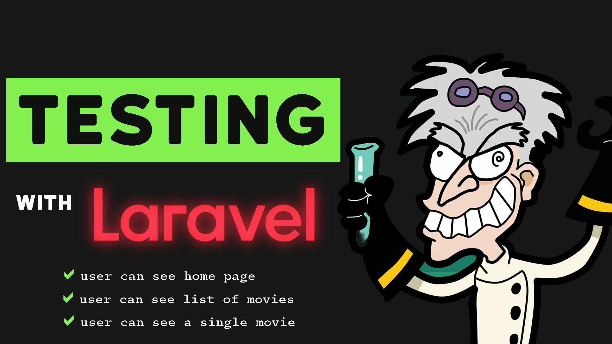

## Learn Laravel TDD

Watch this video to learn how to use Test Driven Development to build your Laravel API. We will be using Laravel Sail, a Docker powered
package, to run our local application. 
